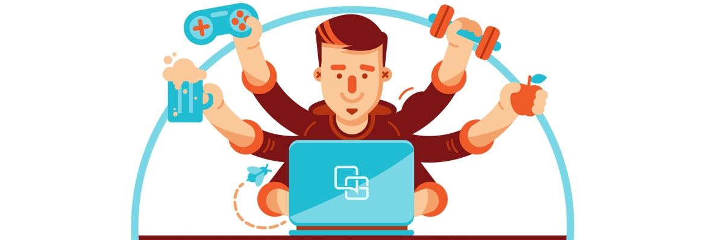

# 
Hi 👋, I'm Mohsin Iqbal

**Welcome to my profile!**

 

## 🙋‍♂️ About Me

- 🔭 I’m currently working on BackEnd

- 🌱 I’m currently learning **NodeJS, Expressjs and mangoDB**

- 👨‍💻 All of my projects are available at **[My Portfolio](https://github.com/Mohsin013)**

- 📫 How to reach me **mohsiniqbal826635@gmail.com**

- 📄 Know about my experiences **[LinkedIn](https://www.linkedin.com/in/mohsin-iqbal-424336237/)**

- ⚡ Fun fact **I enjoy solving Problems.**

 

## ⚙️ My skills

### 📚 Learning

## 📊 My Github Stats
 

## Connect with me:
 

 
